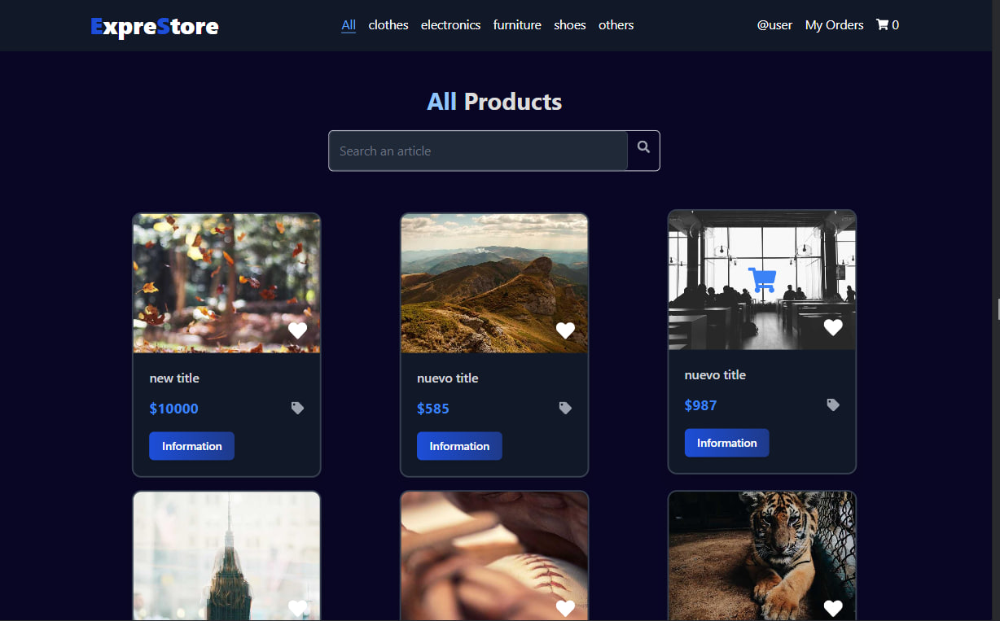

# ExpreStore 🛍️

ExpreStore es un proyecto personal creado para práctica y mejoramiento de habilidades en desarrollo web. 🚀

## Características 🌟

- 🔍 Búsqueda de productos.
- 💳 Simulador de pago.
- 📋 Registro de órdenes y historial de compras.
- ✏️ Operaciones CRUD para gestionar productos.
- 💾 Almacenamiento persistente con `localStorage`.

🎥 [Demo en video](#) (https://651240c75978741d855a6d69--quiet-sunflower-b3c570.netlify.app/my-order)

## Tecnologías 🛠️

- 🟣 React: Librería de JavaScript para construir interfaces de usuario.
- 🎨 Tailwind CSS: Marco de diseño utilitario.
- 🪝 Hooks de React: Utilizados para mejorar la lógica y la reusabilidad del estado.
- 📡 API de Platzi False Store: Para manejo y recuperación de datos de productos.
